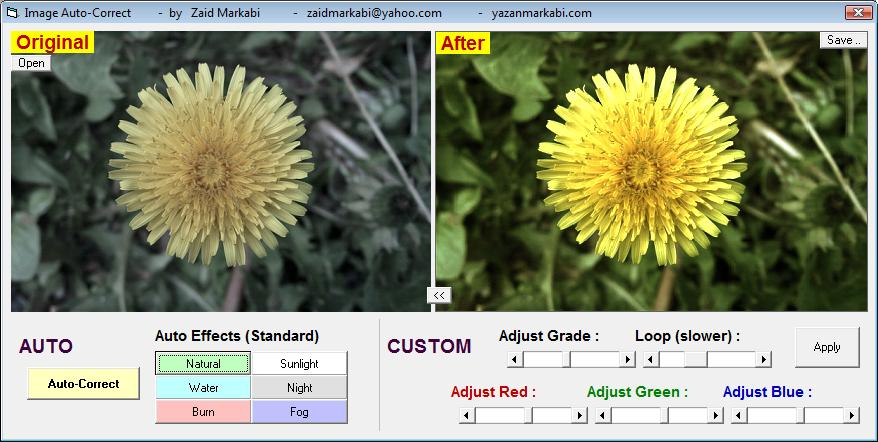



## a Super Image Auto\-Correction

### Description

See screen-shot.

This tool can be used to Correct image's colors, Refresh old photos, Adjust colors.

And it includes several standard effects like Natural-Sunlight-Night-Sea-Fog-Burn.

Also it's very fast in processing images.
 
### More Info
 

             |
---                |---
**Submitted On**   |2010-09-09 01:21:48
**By**             |[Zaid Markabi](https://github.com/Planet-Source-Code/PSCIndex/blob/master/ByAuthor/zaid-markabi.md)
**Level**          |Beginner
**User Rating**    |5.0 (30 globes from 6 users)
**Compatibility**  |VB 5\.0, VB 6\.0
**Category**       |[Graphics](https://github.com/Planet-Source-Code/PSCIndex/blob/master/ByCategory/graphics__1-46.md)
**World**          |[Visual Basic](https://github.com/Planet-Source-Code/PSCIndex/blob/master/ByWorld/visual-basic.md)
**Archive File**   |[a\_Super\_Im218778992010\.zip](https://github.com/Planet-Source-Code/zaid-markabi-a-super-image-auto-correction__1-73423/archive/master.zip)

